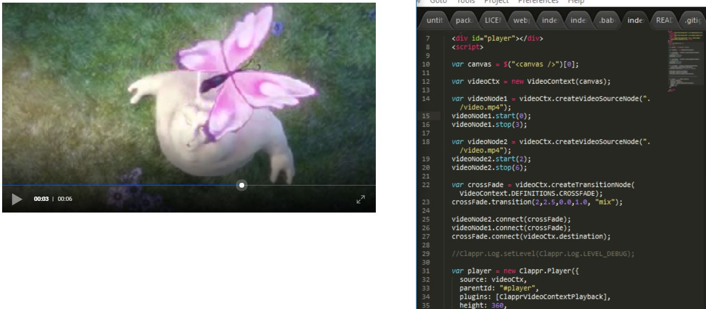

# clappr-videocontext-playback
A clappr playback for the BBC's video context tool.

This is a proof-of-concept to integrate the [BBC's video context tool](https://github.com/bbc/VideoContext) with [clappr](https://github.com/clappr/clappr) as a playback.

I have tweaked Clappr slightly to make this work (hance why clappr is in the demo folder) but will be submitting PR's with those changes.

Checkout the demo in the demo folder or at [http://tjenkinson.me/clappr-videocontext-playback](http://tjenkinson.me/clappr-videocontext-playback)
